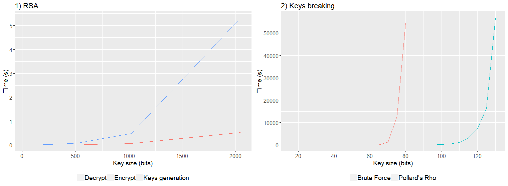

# Cryptography algorithm RSA — Rivest-Shamir-Adleman

The RSA algorithm uses a pair of keys to encode and decode messages, this keys are the public and the private keys, respectively. The effectivity of this method is due to the relative facility to check that a given number is prime and to the difficulty to execute the number factoring. Therefore, this post aims to analyse, in computational terms, the time complexity of the RSA algorithm and demonstrates its robustness in breaking a given cypher using two different techniques, brute force and Pollard’s Rho. The results validates the polynomial time of the cryptographic process and the exponential time of the cryptography breaking process.

## Introduction

Cryptography is a system based on substitution and permutation of symbols to encode messages in order to guarantee security and authenticity in the information exchange between two individuals. The symmetric and asymmetric cryptography are the two most famous methods. In the symmetric cryptography it is required that both communicating sides have the same key to encrypt/decrypt the message, while in the asymmetric cryptography two different keys are used, one to encrypt and one to decrypt the message [Stallings et al. 2008].

The RSA security basis and applicability today is due to computational capabilities in executing primality tests and composite numbers factorizations. Basically, it is computationally efficient to validate if a number is prime to generate a public and a private key pair that will be used to encrypt and decrypt messages. However, it is computationally expensive to perform the factorization of a composite number on its prime factors, this fact makes difficult to find the public and private pair of keys numerical origin (breaking encryption) [Dasgupta et al. 2006].

In this context, this study will analyze the RSA algorithm complexity and its robustness against two factorization algorithms applied to break the public key. Are these methods the brute force and the Pollard’s Rho [Cormen and Leiserson 2009].

## Complexity Analysis

RSA depends on some mathematical functions used for key generation, encryption, and decryption. Thus, this section will present the RSA main operations and their computational complexity.

### Arithmetic operations

In digital computers, several arithmetic operations can be performed in constant time when it is possible to allocate numerical values in the computer word (e.g. 32 bits). However, when dealing with time complexity analysis, the computer word represents a constant value and the numerical values are generally larger than the word size. Thus, the analysis of the following operations takes into account a bit-by-bit analysis.

In this analysis, by convention, two numbers x and y of size n bits each will be considered to give the examples [Dasgupta et al. 2006].

* Sum (x + y), the sum of two numbers with n-bits of size, results in a maximum number of (n + 1)-bits (ex: 9 + 9 = 18). Using the elementar sum method, we position the number x above the number y in a paired fashion and then sum from right to left using carry to pass the overflow value to the next digit. At the end of the process, n operations were executed, resulting in a time complexity of O(n) [Dasgupta et al. 2006].
* Subtraction (x - y), the subtraction can result in a number with size smaller than n-bits. Using the Two’s Complement subtraction method, all digits of y are inverted and we sum to the result 1, then we sum x + y ignoring the overflow of bit n + 1. This method has an inversion that consumes n steps and a sum that takes (x + y) = O(n), so the time complexity of the subtraction is O(n).
* Multiplication (x * y), the result of multiplying two numbers with n-bits will result in a number with a maximum size of 2n-bits. Using the elementary multiplication method, we position x above y and for each bit of y with value 1 a cumulative sum of x is performed by managing the left-hand shifts. Thus, in the worst case where all bits of y are 1, then will be exactly n sum with complexity of O(n), that results in a time complexity of O(n²). There are methods with better times, for example, the Karatsuba algorithm that with some mathematical artifice reaches a time complexity of O(n^1.58) [Dasgupta et al. 2006].
* Division (x / y), given a number x*y of 2n-bits, the division algorithm presented in [Dasgupta et al. 2006] seeks to find a coefficient q and a remainder r. Basically, in each step of the iteration is divided the input number by 2 (reducing 1-bit number), which implies n iterations of the algorithm. In addition, in each step q and r are multiplied by 2 (shift-to-left operation) that consumes time O(n). Thus, since the algorithm executes n recursive steps and at each step consumes time O(n) the final time complexity is O(n²).

In addition to basic arithmetic, RSA also uses exponentiation and modular operators. To achieve a significant level of security, RSA must handle large numeric values that is possible due to the modular arithmetic. Basically, the modular arithmetic is a system used to deal with restricted intervals of integers, defined as x mod N when x = qN + r, with 0 ≤ r < N [Dasgupta et al. 2006]. Following will be presented the time complexity of these functions.

* Module (x mod N), given x with n-bits, the modular operation returns the remainder of x / N division. Since this algorithm performs a division to return the remainder, the algorithm time complexity is O(n²) [Dasgupta et al. 2006].
* Modular exponentiation (x^y mod N), solving x^y before solving the modulus has an exponential time growth related to the bits number of y. Therefore, is more efficient to solve and combine the intermediate parts in order to reduce the problem. In [Dasgupta et al. 2006] is presented a modular exponentiation algorithm, that given x, y and N of n-bits, the algorithm executes n recursive calls (each call is made recursively with y / 2 unit that y reaches 0) and in each call a division and a multiplication of n-bits (O(n²)) is done resulting in a time complexity of O(n³).

### Euclids Extended Algorithm and Multiplicative Inverse

Before to present the extended version, it is interesting to analyze the basic version of the Euclid’s algorithm. This algorithm computes the largest common divisor between two numbers a and b using the mdc(a, b) = mdc(b, a mod b) rule. This algorithm returns the last value from a as the largest common divisor when b is zero. To analyze the algorithm, consider a and b of n-bits and at every step of iteration a mod b < a/2. Thus the algorithm will execute at most n recursive calls (because each division reduces 1-bit of n). In addition, in each recursive step a division (complexity O(n²)) is performed to extract the new parameter b for the next call. Calculating the total time we get O(n) * O(n²) = O(n³) [Dasgupta et al. 2006].

The extended version of Euclid’s algorithm is the key to executing divisions in modular operations. This algorithm computes the largest common divisor (mdc) and its modular inverse. For two positive integers a and b, the extended Euclid algorithm returns three integers x, y and d such that mdc(a, b) = d = ax + by. In the extended version the time complexity is the same as the original, since this extension only adds one more step that accumulates the values of x and y during the recursive calls returning [Dasgupta et al. 2006].

The multiplicative inverse x of a number a mod N is computed using the extended Euclid algorithm. The multiplicative inverse exists if two prime numbers a and N respect mdc(a, N) = 1 and is represented by a x such that ax ≡ 1 mod N. Due to the use of the extended Euclid algorithm, the time complexity is O(n³) [Dasgupta et al. 2006]. Generally, a simplified version of this algorithm (which does not change the time complexity) is used to return a positive multiplicative inverse, this version is calculated using the rule p(i) = p(i-2) - p(i-1)q(i-2), with p(0) = 0 and p(1) = 1 [UCDenver 2018].

### Euler’s totient function

Euler’s totient function, Φ(N), calculates the relative primes numbers of N that are less than N. In the case of N to be a prime number, the totiente function returns the value of N-1, because all numbers 1, 2,…, N-1 are primes relative with N. When N is composed by two prime factors p and q, the totient function is expressed by the equation Φ(N) = Φ(pq) = (p-1)(q-1) [Stallings et al. 2008].

The Φ(N) algorithmic complexity is O(n²) where n represents the bits number of N. This complexity calculation considers two subtractions and one multiplication, O(n) + O(n) + O(n²) = O (n²). The totient function is used in the cryptographic process to find two values e and d such that ed ≡ 1 mod Φ(N). These values will compose the public and private keys.

### Primality Test

In order to guarantee the security of the RSA algorithm it is necessary to select two very large primes p and q that will compose the cryptographic key, N = pq. Usually, the N key is defined with a size of n-bits, due to this fact each prime number will have a size of n/2. For a given number p, we can test its primality by verifying the divisibility of p by the numbers between 1 and the square root of p. However, this primality test is computationally expensive, because when p is too large the time complexity will grow exponentially, given by O(2^n).

At the practice, probability and the little Fermat theorem are used to execute the primality test. The little Fermat theorem, given by x^(p-1) ≡ 1 mod p, guarantees that every prime number p with respect to an arbitrary number x < p when raised to p-1 is congruent to 1 mod p. But it does not guarantee the other side, that is, can exists a composite number p classified as prime. Luckily, this set of numbers is very small (Carmichael numbers) and every time you run the Fermat test with a new x number, you increase the probability that a prime number is in fact prime. Therefore, the solution is to run the Fermat test a sufficient number of times. The literature indicates approximately ln(p)/2 [Stallings et al. 2008].

Exists an extension of the Fermat’s little theorem, called the Miller-Rabin test, that can detect with greater probability if a given number p is actually prime. Basically, the Miller-Rabin test defines two variables k and q such that to satisfy p-1 = q2^k. After that, a random number a, 1 < a < p-1, is used to test the primality of p. In this case, if p is prime, then a^q mod p = 1 or a^(q2^ j) mod n ≡ n - 1 given 0 ≤ j < k. The Miller-Rabin test, at each run, has the probability of not detecting a compound number p as a compound of 1/4 [Stallings et al. 2008].

In the Miller-Rabbin algorithm, given a number p with n-bits, the most expensive operation is the modular exponentiation, that has a complexity of O(n³). In addition, to ensure a significant level of confidence, this test is executed about ln(p) / 2 times, that is, a complexity of O(n) [Stallings et al. 2008]. Therefore, the final complexity is calculated as O(n³)*O(n) = O(n⁴).

## RSA

Now we will presents the RSA algorithm. For simplicity, the functions implementation will be abstracted and the time complexity analysis presented before will be taken in consideration. The algorithm below presents the first RSA step, that is, the keys generation. The input parameter n defines the key bits size. In practical applications it is recommended to use te key size as 2048 or 4096 bits [Stallings et al. 2008]. Besides that, a Java implemenation is available at the GitHub.

```
keyGeneration(n) {
  p <- generateRandomPrime(n/2)
  q <- generateRandomPrime(n/2)
  N <- p * q
  Φ <- calculateTotient(p, q)
  e <- generateRelativePrime(Φ)
  d <- calculateModularInverse(e, Φ)
  return PU(N,e),PR(N,d)
}
```

The following items describe each algorithmic function from keyGeneration. For simplicity we consider the elementary multiplication (complexity O(n²)) instead of karatsuba multiplication (complexity O(n^1.58)). In addition, the entire analysis is based on the cryptographic key size, that is, the value of n.

* generateRandomPrime, this function tests random n-bits sized numbers until a prime is found through the Miller-Rabin test. The Miller-Rabin test has complexity of O(n⁴), stating as constant (O(1)) the generation of random numbers, the time complexity becomes O(1) + O(n⁴) = O(n⁴).
* N = p*q, as presented above, the elementary multiplication time complexity is O(n²).
calculateTotient, the Euler Totient calculation performs two subtractions O(n) and one multiplication O(n²), so the time complexity is computed as O(n) + O(n) + O(n²) = O (n²).
* generateRelativePrime, finding a relative prime of Φ involves choosing one of the first five Fermat’s primes (3,5,11,257,65537). Thus we select the first Fermat prime that validate MDC(e, Φ) = 1 using the Euclid’s algorithm. Since the determinant in this case is the Euclidean algorithm, the time complexity is O(n³).
* calculateModularInverse, the computation of the modular inverse de ≡ 1 mod Φ is done using the extended Euclid’s algorithm. As seen before, the time complexity is O(n³).
The final RSA complexity is defined by the keys generation function, that is invoked only once and this function depends on the size of n. Therefore, we considers in the calculation the combination of the parts O(n⁴) + O(n⁴) + O(n²) + O(n²) + O(n³) + O(n³) which results in a time complexity of O(n⁴), which is polynomial with respect to n.

The message encryption process can be codified in a letter-by-letter or letters-blocks fashion, that will be converted to an equivalent numerical code M, such that M < N. After that, the message is codified with the function C = M^e mod N, where N and e are defined by the public key PU(N, e). This function depends of a modular exponentiation to generate the C number, and due to this fact, this function time complexity is given by O(n³).

The decryption is done under the same rule of code segmentation applied in the encryption (letter-to-letter or letters-blocks). The decryption process applies the formula M = C^d mod N on the cipher using the private key values PR(N, d) to retrieve the original message M. Since this formula depends of a modular exponentiation, the time complexity is O(n³).

## Cryptography break

The cryptographic breaking process seeks to find the prime factors p and q such that N = pq. Since N is available in the public key PU(N, e), when we find the factors of N, we can calculate the function Φ(N) and the inverse multiplicative d of e. Therefore, finding the private key PR(N, d). However, factoring is a computationally expensive process, especially when N is too large. Currently, there is no known algorithm that can perform this task in polynomial time. To demonstrate this difficulty, we will present the analysis of two factorization algorithms: brute force and Pollard’s rho [Cormen and Leiserson 2009].

### Brute Force

The brute force cryptographic algorithm attempts to find the prime factors p and q that gave rise to the N value, testing the division of N for all odd numbers within the range [3, √N]. However, this method has an exponential time complexity at the order of O(2^n), where n represents the bits number of N. Limiting the tests number with √N just reduces the bits number of n to n/2 , since √N * √N = 2n/2-bits, that is, only reduces complexity by a constant. If we consider 2^(n/2) and ignore the constants, the time complexity is still exponential in O(2^n).

### Pollard’s Rho

The Pollard’s Rho algorithm is a heuristic for integer factorization. This algorithm uses a small memory amount space and is expected to run at a time proportional to the square root of the smallest prime factor. Because it is a heuristic, neither its execution time nor its success are guaranteed, but the algorithm proves to be very effective in practice [Cormen and Leiserson 2009]. This algorithm is based on probabilities, unlike the brute force algorithm that tries to find a factor that divides N with a probability of 2 / √N, Pollard’s algorithm Rho seeks to find two numbers x(i) and x( i + 1) having MDC(x(i + 1) - x(i), N) > 1. In general this method is more efficient because there are p + q + 1 numbers that have common divisor in conjunction with N greater than 1, these are p, 2p, 3p, …, (q-1)p, q, 2q, 3q, …, (p-1)q [Colorado 2018].

## Experiments

To demonstrate the RSA cryptographic breaking algorithms efficiency, a quantitative comparison was applied. The software was developed using Java (JDK 9.0.4) and run on a server hosted on DigitalOcean. The hardware used was a computer with 2GB of RAM and an Intel (R) Xeon (R) Platinum 8168 CPU @ 2.70GHz processor. The algorithms execution times were measured in the keys generation, encryption, decryption and breaking steps (Brute Force and Pollard’s Rho). To the RSA tests, keys with [16, 32, 64, …, 1024, 2048] bits were used. Whereas for the cryptographic breaking algorithms, keys with [16, 20, 25, 30, …, 120, 125, 130] bits were used. In addition, execution was done 30 times for each key size in each of the tests. Before tot run the breaking algorithms, to generate the test scenarios, the RSA was executed to create the public key and to encode the following message “Universidade Estadual de Santa Catarina UDESC”.



In terms of efficiency, the RSA algorithm is computationally feasible. Figure 1 demonstrates the impact on runtime in relation to the size of the key in each RSA process (Decrypt, Encrypt, Keys generation). The most costly function is the keys generation, which on average consumes 5 seconds for 2048-bit keys. In addition, by comparing the encryption and decryption steps, the encryption is more efficient by using a low-value public key. While decryption, which involves the value of the modular inverse, grows faster with increasing key size.

Comparing the cryptographic public key breaking process, Figure 2 presents the results of the breaking algorithms. It is observed that both algorithms have an exponential growth in relation to the key size. Pollard’s Rho heuristic can efficiently break public keys up to 115 bits, while the brute-force algorithm can efficiently break keys up to 70 bits. It is noticed that the runtime curves are exponential in relation to the size of the key. This proves the efficiency of the RSA in relation to the keys breaking algorithms, where for large key values (greater than 1024), a lot of processing time is required.

## Conclusions

This work studied the asymmetric RSA cryptographic method by analyzing the time complexity of each procedure. In addition, an evaluation of the cryptographic breaking process was performed comparing two well-known methods: Brute Force and Pollard’s Rho heuristic.

The analysis performed in this work classified the generation of keys with complexity O(n⁴) and the cryptographic and descriptographic process as O(n³), where n is the keys size number in bits. Thus, by validating in practice that the complexity of the RSA functions are polynomial with respect to the bit key size.

Analyzing the cryptographic breaking methods, it has been validated that both are exponential in the order of O(2^n), with n being the key size in bits. Although the Pollard’s rho method is more efficient than the brute-force method, both are not feasible for cryptographic wrapping in real-world scenarios.

## References

Colorado (2018). A quick tutorial on pollard’s rho algorithm. https://www.cs.colorado.edu/˜srirams/courses/csci2824-spr14/pollardsRho.html. [Online; accessed 21-April-2018].

Cormen, T. H. and Leiserson, C. E. (2009). Introduction to algorithms, 3rd edition. The MIT Press.

Dasgupta, S., Papadimitriou, C. H., and Vazirani, U. V. (2006). Algorithms. McGraw-Hill Education.

Stallings, W., Bressan, G., and Barbosa, A. (2008). Criptografia e segurança de redes (4a. ed.). Pearson.

UCDenver (2018). The Extended Euclidean Algorithm. http://www-math.ucdenver.edu/˜wcherowi/courses/m5410/exeucalg.html. [Online; accessed 21-April-2018].